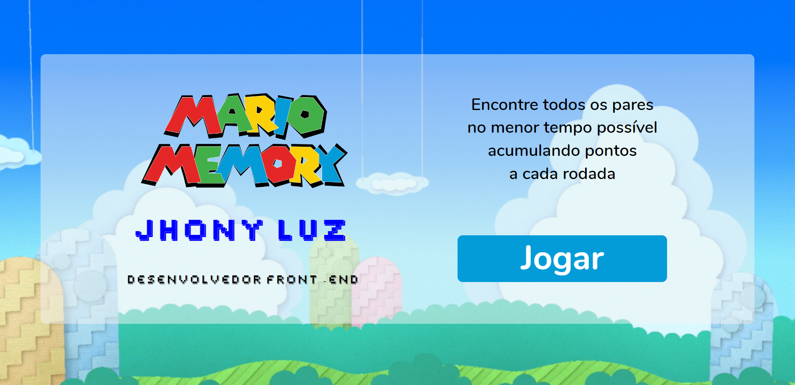
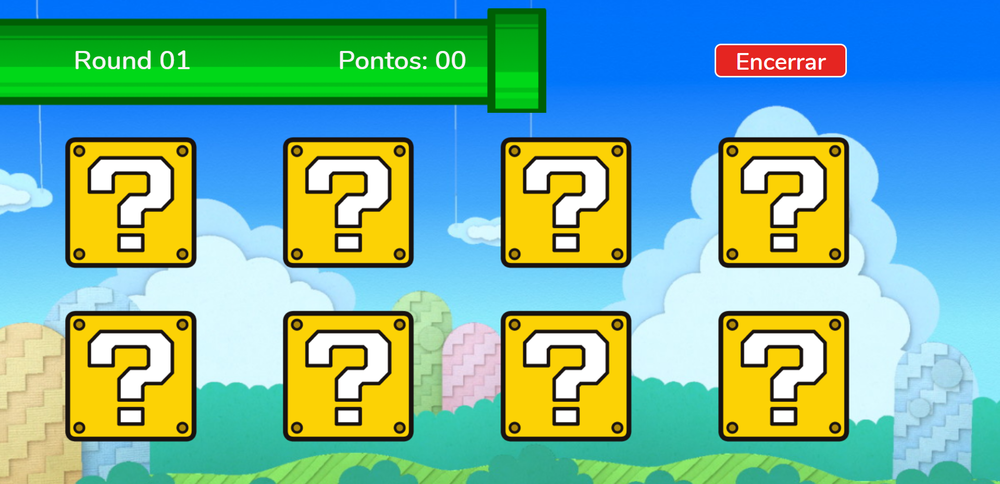

<h1 align="center">
    
    
</h1>

<h1 align="center">
   <a href="#"> Jogo da memória</a>
</h1>

<h3 align="center">
    Projeto desenvolvido para Evoluir
</h3>

<h4 align="center"> 
	 Status: Em desenvolvimento
</h4>

## Layout

- [Layout](<https://www.figma.com/file/cgUSAEGgSCJN8hxygzUL19/Maratona-Programa-para-Evoluir-(Copy)?node-id=0%3A1>)

     •
    <a href="https://jhonlight.github.io/mario/">Click Aqui </a> •
    

## Sobre

Um site com tela de etapas

---

## Recursos

- Html
  - [x] Estrutura pronta
- Css
  - [x] Cores e tamanhos definidos
- Javascript
  - [x] tela de abertura
- Design responsivo
  - [x] para todas as telas

---

## Autor

 

---

## Referências

- [W3Schools referência HTML](https://www.w3schools.com/tags/default.asp)
- [W3Schools referência CSS](https://www.w3schools.com/cssref/default.asp)
- [Google Fonts](https://fonts.google.com/)
- [Coolors](https://coolors.co/palettes/trending)
- [Paletton](https://paletton.com/)
- [W3Schools propriedades CSS no DOM](https://www.w3schools.com/jsref/dom_obj_style.asp)
- [MDN lista de eventos](https://developer.mozilla.org/en-US/docs/Web/Events)
